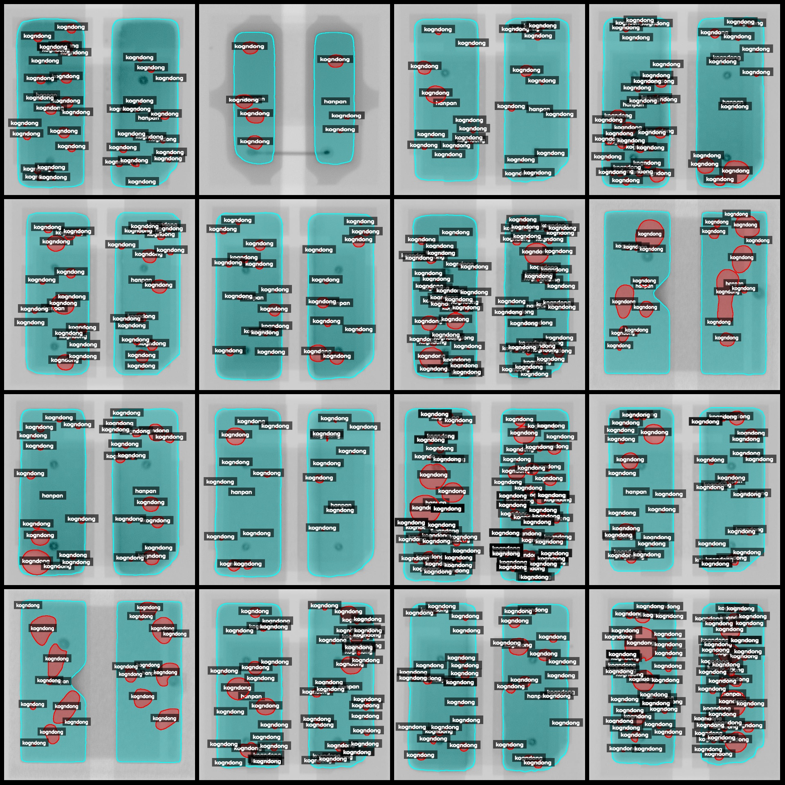
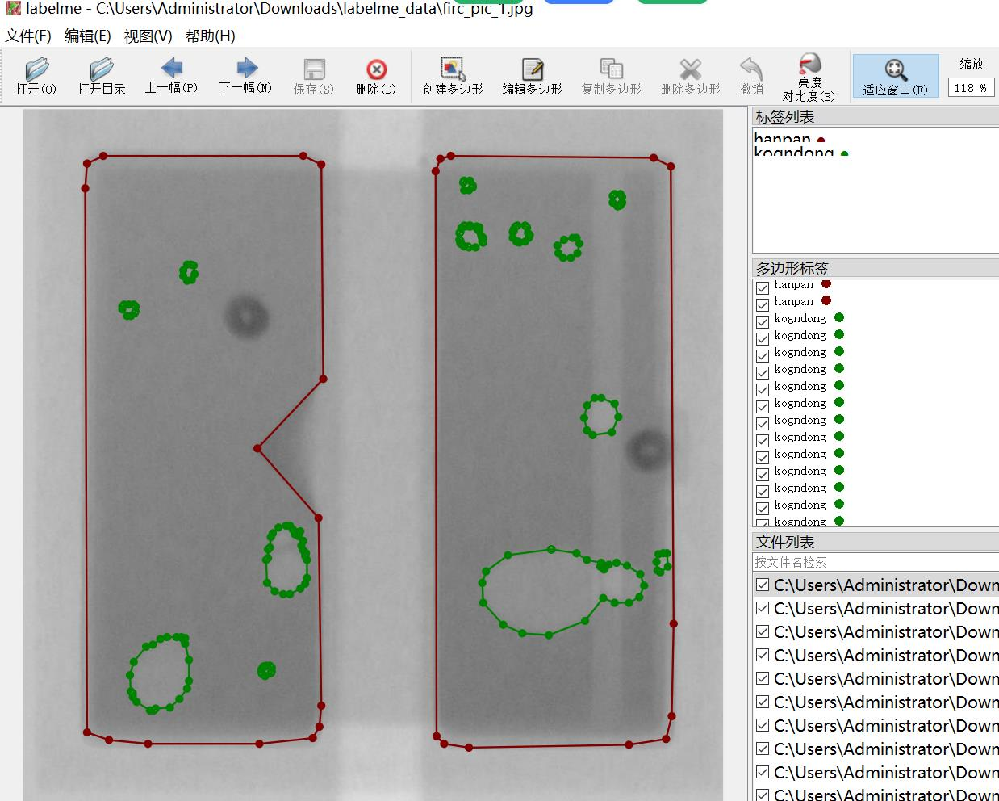

# Weld Spot Hole Identification and Segmentation Dataset - LabelMe Format: 4982 Images in 2 Categories

Dataset Format: LabelMe format (without mask files, only including JPG images and corresponding JSON files)
Image Count: Number of JPG files (JPG file count): 4982
Annotation Count: Number of JSON files (Annotation file count): 4982
Number of Annotation Categories: 2
Annotation Category Names: ["hanpan", "kogndong"]
Number of Boxes per Category:
hanpan (Weld Spot) count = 9965
kogndong (Holes/Porous Areas) count = 160328
Total Boxes: 170293
Annotation Tool Used: labelme=5.5.0
Image Resolution: Multiple resolution images, such as 621x701, 735x730, etc.
Annotation Rules: Polygon drawing for categories
Important Notice: The dataset can be edited using the labelme tool, but the JSON dataset needs to be converted into either mask or YOLO/COCO format for semantic segmentation or instance segmentation.
Special Notice: This dataset does not guarantee the accuracy of the trained models or weight files.
Image Preview:
Annotation Example:
Original Image (randomly select 16 images):
Annotation Drawing Results:
LabelMe Editing Image Example:

## Picture

Here is a pay link on Stripe ( https://buy.stripe.com/3cs8yP7sY87d0vu9AB ). Please contact me lonlonago@foxmail.com after funding $89, and I will send you a complete data files , thank you!

